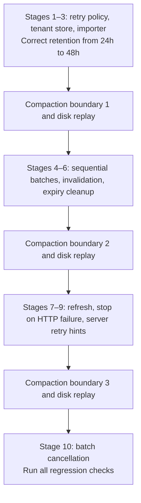
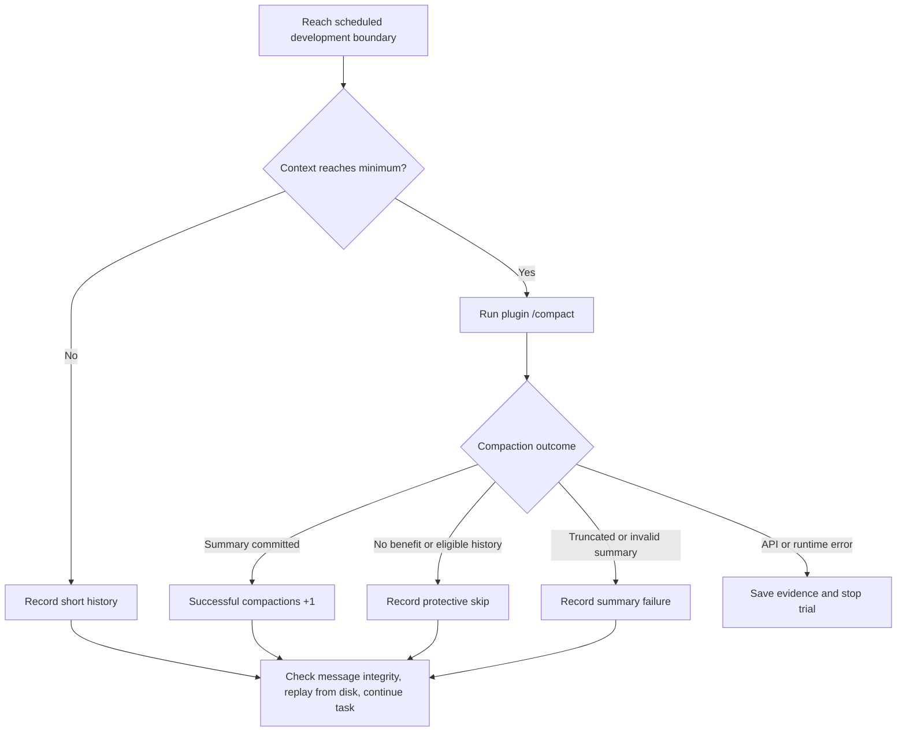

# Coding continuation after repeated compaction

English | [简体中文](continuation-evaluation.zh-CN.md)

A real model edits and executes an invoice-import library across development stages, with three compaction boundaries and disk replays. Task correctness, committed summaries, and session replay are scored separately. All eight plugins use the same task and acceptance rules.

## Run

Build the packages and supply `DEEPSEEK_API_KEY` through the environment, or explicitly load the Git-ignored `.env.local`:

```sh
pnpm build
node --env-file=.env.local scripts/check-deepseek-continuation.mjs

# Both configurations, all eight plugins, one shared baseline per repetition
node --env-file=.env.local scripts/check-deepseek-continuation.mjs --budget-mode both
```

Defaults: `deepseek-flash`, thinking disabled, `invoice-import-v2`, fixed budget, all eight plugins, and an uncompressed baseline. Every trial starts with fresh files and a fresh session. With the key already exported, use `pnpm test:continuation`. Real runs incur API usage.

```sh
pnpm test:continuation --repeats 3
pnpm test:continuation --agent qwen-code --max-summary-tokens 4096 \
  --output .artifacts/continuation/qwen-new-run
pnpm test:continuation --help
```

`--agent <id>` selects any plugin; `--skip-baseline` omits the baseline. `--output` must name a new directory. Otherwise the runner creates a temporary directory and prints its path. Later runs never overwrite failed observations.

## Ten-stage task

`invoice-import-v2` has three editable modules, ten development stages, and 43 final acceptance cases. The model uses `read_file`, `write_file`, and `run_tests` to operate on actual files and execute current code. History accumulates through development work without repeated filler logs.



Later prompts refer to earlier agreements without repeating every value; requirement revisions check whether old instructions are superseded. The read-only README documents interfaces without the full business requirements or a reference solution. Re-reading code after compaction is allowed and measured with content hashes.

`--task invoice-import-v1` retains the earlier four-stage, 24-case task. Add `--max-summary-tokens 2048 --summary-ceiling 4096 --min-context-tokens 0` for its earlier fixed budgets. The new evaluator continues after rejected summaries, so its scores must remain separate from the earlier evaluator that stopped immediately.

## Boundaries and outcomes

V2 checks context after stages 3, 6, and 9. Below the default estimate of 4,096 tokens it records `skipped-short-history`; otherwise it invokes the plugin's `/compact`. Adjust this with `--min-context-tokens`. The floor cannot guarantee that the plugin's selected history will benefit from compression.



| Outcome | Meaning | Next action |
| --- | --- | --- |
| `committed` | Successful command, one new summary, and history replacement | Count the summary, replay, continue |
| `skipped-short-history` | Below the evaluator's context floor | Replay and continue |
| `skipped-no-eligible-history` | Plugin selected no compactable history | Replay and continue |
| `skipped-no-benefit` | Summary plus restored content does not reduce history | Replay and continue |
| `pruned-only` | History was pruned without a new summary | Replay and continue; no summary credit |
| `summary-truncated` | Summary reached its output limit | Record failure, replay, continue |
| `summary-invalid` | Summary was empty or had invalid format | Record failure, replay, continue |
| `provider-error` / `runtime-error` | API, persistence, or other execution error | Stop trial and retain the specific error |

Each boundary invokes the command once; a plugin may make multiple internal summary requests. A skip is not retried in place. Later development boundaries remain eligible. The baseline reloads at identical boundaries without compaction.

## Scoring

Development tests expose a few examples. Independent acceptance results run after each stage and never enter model history. Final checks cover tenant isolation, expiry boundaries, retry/helper interactions, refresh, batch ordering, and cancellation. No model judge is used.

The report records:

- `taskStatus`: all final cases pass, and every stage changes source and runs development tests after its last write.
- `compactionStatus`: three summaries were committed. Pruning, skips, and failures earn no credit.
- `replayStatus`: all three disk replays preserve model-visible messages and balanced tool pairs.
- `continuedAfterThirdCompaction`: source changed after the third successful compaction.

`passed` requires all conditions; the baseline is exempt from summaries. A correct task with insufficient compactions is `compaction-incomplete`; incorrect code or missing development work is `task-failed`; an execution that cannot continue is `runtime-error`. Later stages may repair earlier acceptance failures, whose records remain visible. Protected system/developer messages and tool pairs are checked after compaction. A replay failure prevents a complete pass.

## Budget modes

| Mode | Plugin configuration | Purpose |
| --- | --- | --- |
| `fixed` (default) | Summary cap 4,096; `maxSummaryAttempts: 1`; `maxOverflowRetries: 0`; recent-history budget 256 (0 for Claude/Qwen) | Compare under fixed budgets |
| `plugin-defaults` | Only `auto: false`; plugin defaults choose summary, retention, and retry settings | Observe defaults at manual boundaries |
| `both` | Run each configuration with a fresh project; share one baseline per repetition | Compare configuration effects |

Automatic triggers and provider transport retries are disabled in both modes. The model route output ceiling defaults to 8,192 and can be changed with `--summary-ceiling`; plugin defaults remain constrained by that ceiling. Task calls have an independent 4,096-token cap. `--max-summary-tokens` changes fixed mode only and cannot exceed the route ceiling. Reports record configuration overrides and every summary request's actual cap. These modes do not measure default automatic trigger policies.

## Artifacts and execution limits

Output includes `report.json`, bilingual `report.md` / `report.zh-CN.md`, `final-sources.json`, and each trial's project, stage sources, three boundary sessions, and final session. Reports retain skip/failure reasons, durable failure events, stage acceptance, actual source hashes, token estimates, model requests, and repeated reads. Strategies pair with the shared baseline from the same repetition; modes have separate aggregates. Missing API usage is counted separately from zero usage.

- `--max-steps` defaults to 12 model requests per stage, with up to eight tools per response.
- HTTP timeout: 90 seconds. Default global budget: `conditions × repetitions × (stages × maxSteps + 30)`, capped at 2,000; override with `--max-http-requests`.
- Only the official DeepSeek API is allowed. Authentication/billing denial or an exhausted HTTP budget stops further conditions.
- Each source file is limited to 64,000 bytes; test subprocesses have a five-second deadline and a 96 MiB V8 heap limit.
- Code runs in a separate Node process and restricted module context without host globals, external imports, networking, subprocess creation, or filesystem writes. Credentials never enter the task project, worker, prompts, or session.
- These controls serve this fixture. Node must support `--permission` and `--experimental-vm-modules`.

## Scope and results

This is a controlled small project executing real code. Production repositories, automatic thresholds, actual context exhaustion, and long-term cache behavior need other tasks. Defaults retaining more recent history may complete the task with insufficient summaries. Use more repetitions and task families before comparing strategy quality.

The [extended live results](../reports/continuation/2026-09-29/extended/README.md) and [earlier results](../reports/continuation/2026-09-29/README.md) are retained separately and are not pooled as repetitions of one task.

`pnpm check` covers all eight plugins in fixed and default configurations, continued work after summary rejection, short histories, API errors, three disk replays, hidden acceptance isolation, reference solutions, and deliberate regressions. These offline tests validate the evaluator; real API runs measure model outcomes.
