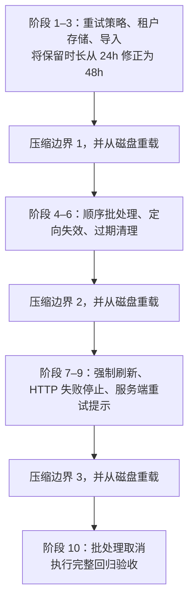
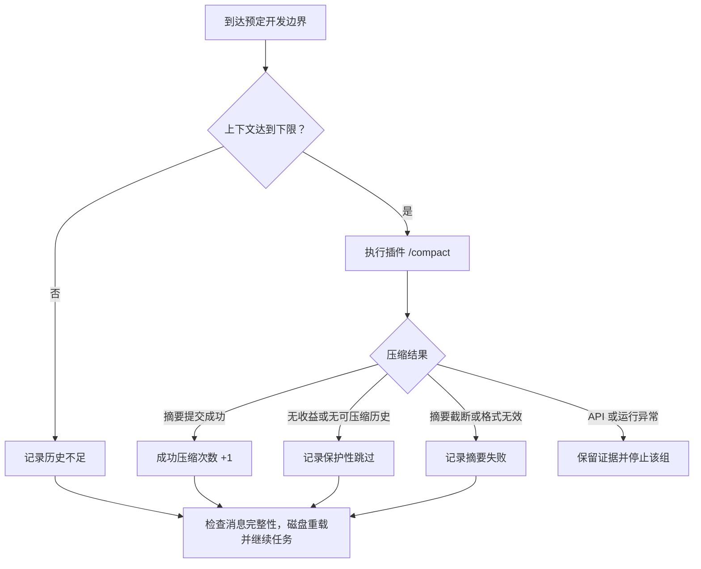

# 多次压缩后的编码续接评测

[English](continuation-evaluation.md) | 简体中文

评测让真实模型分阶段修改并执行一个发票导入库，并在三处开发边界尝试压缩、从磁盘重载会话。分别衡量任务正确性、实际压缩次数和会话重载。八个插件使用相同任务和验收规则。

## 运行

先构建插件，通过环境变量提供 `DEEPSEEK_API_KEY`，或显式加载 Git 已忽略的 `.env.local`：

```sh
pnpm build
node --env-file=.env.local scripts/check-deepseek-continuation.mjs

# 两种参数模式、八个插件，每轮共享一个基线
node --env-file=.env.local scripts/check-deepseek-continuation.mjs --budget-mode both
```

默认使用 `deepseek-flash`、关闭思考，运行 `invoice-import-v2`、固定预算、八个插件和一个未压缩基线。每次使用新的项目与会话。已导出环境变量时也可使用 `pnpm test:continuation`。真实运行会产生 API 用量。

```sh
pnpm test:continuation --repeats 3
pnpm test:continuation --agent qwen-code --max-summary-tokens 4096 \
  --output .artifacts/continuation/qwen-new-run
pnpm test:continuation --help
```

`--agent <id>` 可选择任意插件，`--skip-baseline` 可跳过基线。`--output` 必须指向新目录；不指定时新建临时结果目录并打印路径。失败样本不会被后续运行覆盖。

## 十阶段任务

`invoice-import-v2` 有三个可修改模块、十个开发阶段、43 项最终验收。模型通过 `read_file`、`write_file` 和 `run_tests` 实际读写文件、执行代码。历史来自这些开发操作，没有为凑长度重复填充日志。



后续提示引用早先约定，不重复所有取值；需求修正检查旧要求能否被替代。只读 README 说明接口，不包含完整业务要求或参考实现。压缩后允许重新读取代码，并记录读取次数与内容哈希。

`--task invoice-import-v1` 保留早先的四阶段、24 项验收任务。复现旧协议的固定预算可增加 `--max-summary-tokens 2048 --summary-ceiling 4096 --min-context-tokens 0`。新评分器会在摘要被拒绝后继续任务，因此不与旧版提前停止的评分混用。

## 压缩边界与分类

v2 在阶段 3、6、9 后检查上下文。默认估算不足 4,096 tokens 时记录 `skipped-short-history`；达到下限后调用插件自己的 `/compact`。下限可用 `--min-context-tokens` 调整，它不能保证插件选中的历史一定有压缩收益。



| 分类 | 含义 | 后续处理 |
| --- | --- | --- |
| `committed` | 命令成功，并产生一个新摘要及历史替换 | 计入成功压缩，重载并继续 |
| `skipped-short-history` | 未达到评测设定的上下文下限 | 重载并继续 |
| `skipped-no-eligible-history` | 插件未选出可压缩历史 | 重载并继续 |
| `skipped-no-benefit` | 摘要与恢复内容无法缩小历史 | 重载并继续 |
| `pruned-only` | 只发生裁剪，未提交新摘要 | 重载并继续，不算摘要压缩 |
| `summary-truncated` | 摘要触及输出上限 | 记录失败，重载并继续 |
| `summary-invalid` | 摘要为空或不符合格式要求 | 记录失败，重载并继续 |
| `provider-error` / `runtime-error` | API、持久化或其他运行异常 | 停止该组，保留具体错误 |

每个边界只有一次命令调用；插件内部可能按自身策略发出多个摘要请求。一次跳过不会在原地反复重试，后面的开发边界仍可尝试压缩。基线在相同位置重载，不调用压缩。

## 评分

开发测试只提供少量示例。每阶段后的独立验收结果不会放回模型历史。最终检查包括租户隔离、过期边界、重试与调用方配合、缓存刷新、批处理顺序与取消，不使用模型打分。

报告分别记录：

- `taskStatus`：最终验收是否全部通过，且每阶段实际改代码并在最后一次写入后运行开发测试。
- `compactionStatus`：是否成功提交三次摘要。裁剪、跳过、失败均不计数。
- `replayStatus`：三次磁盘重载是否保持模型可见消息一致、工具配对完整。
- `continuedAfterThirdCompaction`：第三次成功压缩后是否继续修改源代码。

完整协议状态 `passed` 要求以上条件全部满足；基线豁免摘要要求。任务正确但不足三次压缩记为 `compaction-incomplete`；最终代码或开发过程不达标记为 `task-failed`；无法继续运行记为 `runtime-error`。中间验收失败可在后续修复，原始失败记录仍保留。system/developer 消息和工具配对在压缩后继续检查，重载失败会使完整协议无法通过。

## 预算模式

| 模式 | 插件参数 | 用途 |
| --- | --- | --- |
| `fixed`（默认） | 摘要上限 4,096、`maxSummaryAttempts: 1`、`maxOverflowRetries: 0`；最近历史预算 256，Claude/Qwen 为 0 | 比较统一预算条件下的结果 |
| `plugin-defaults` | 仅传入 `auto: false`，使用各插件默认的摘要、保留与重试设置 | 观察默认参数在手动边界上的表现 |
| `both` | 分别执行以上两组，使用新项目；每轮共享一个基线 | 对照预算与默认参数的影响 |

两组均关闭自动触发和提供方传输重试。模型路由输出上限默认为 8,192，可用 `--summary-ceiling` 调整；插件默认参数仍受该路由上限约束。任务调用始终限制为 4,096 tokens，独立于摘要预算。`--max-summary-tokens` 只改变固定模式，且不能高于路由上限。每次报告记录传入插件的配置及每个摘要请求的实际上限。这些模式不衡量默认自动触发策略。

## 文件与执行限制

输出包括 `report.json`、中英文 `report.md` / `report.zh-CN.md`、`final-sources.json`，以及每组的项目、每阶段代码、三处边界会话和最终会话。报告包含跳过或失败原因、持久化失败事件、阶段验收、实际代码哈希、token 估算、模型请求和重复读取。同一轮各策略关联共享基线；不同模式分别汇总。缺失 API 用量单独计数，不能视为零成本。

- `--max-steps` 默认每阶段 12 次模型请求，每次响应最多八个工具调用。
- HTTP 超时 90 秒。默认总请求上限为 `组数 × 重复次数 × (阶段数 × maxSteps + 30)`，最高 2,000，可用 `--max-http-requests` 调整。
- 只允许官方 DeepSeek API；认证、余额拒绝或总请求预算耗尽后停止后续各组。
- 单个源文件最多 64,000 字节；测试进程有五秒期限和 96 MiB V8 堆限制。
- 代码在独立 Node 进程和受限模块环境中执行，无宿主全局对象、外部导入、网络、创建子进程或文件写入能力。凭据不传给测试项目、执行进程、提示或会话。
- 这些控制服务于本测试项目。Node 需支持 `--permission` 和 `--experimental-vm-modules`。

## 范围与结果

这是执行真实代码的小型受控项目；生产仓库、默认自动阈值、实际上下文耗尽和长期缓存行为需要其他任务覆盖。默认参数保留较多近期历史时，也可能出现“任务完成，压缩次数不足”。应增加重复次数和任务类型后再比较策略质量。

[改进后的实测](../reports/continuation/2026-09-29/extended/README.zh-CN.md)与[旧版实测](../reports/continuation/2026-09-29/README.zh-CN.md)分别保留，不合并为同一任务的重复实验。

`pnpm check` 覆盖八插件的固定模式和默认参数续接、摘要拒绝后的继续执行、历史过短、API 异常、三次磁盘重载、隐藏验收隔离、参考实现及故意引入的回归。这些离线测试验证评测机制，真实模型质量由实际 API 结果衡量。
