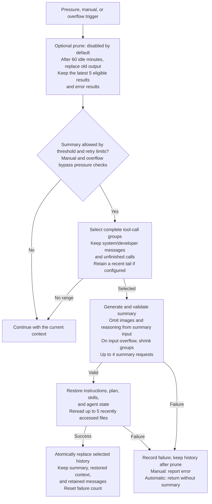

# dsh-context-claude-code

English | [简体中文](README.zh-CN.md)

This package implements the context management workflow observed in Claude Code 2.1.88. The default export is a DSH Cordis plugin; `createPipeline(config)` exports a standalone pipeline, and `strategy` exports budget and source information for comparisons. The shared core provides only model calls, file reads, logging, and safe commits.

```ts
import claudeCodeContext from 'dsh-context-claude-code';

ctx.plugin(claudeCodeContext, { prune: true, idleMinutes: 60 });
```

## npm installation

After release, install with `dsh plugin --profile web add dsh-context-claude-code`. Apply the host Session patch and generate the activation overlay as described in the [npm guide](https://github.com/zonemeen/dsh-context-zoo/blob/main/docs/publishing.md#using-the-published-packages). Installing the package alone does not replace the active context engine.

## Context flow

The diagram uses default settings. Prune replaces old tool output in the active context before the summary decision. A summary failure leaves any completed prune in place. The durable session log keeps the original messages.



Before committing, the host checks that the selected input is unchanged and the summary plus restored context is strictly smaller than the selected history. Cancellation or failed validation prevents the summary commit; any completed prune remains.

## Workflow

1. Use the latest assistant input, cache-read, cache-write, and output usage as a measurement anchor, then estimate messages added afterward. Without usage data, use this package's character and image estimates. Subtract recorded microcompaction savings from the corresponding anchor.
2. Optional idle microcompaction clears older tool results after 60 idle minutes by default, retaining the latest 5 results and always at least 1. It preserves error results and tool-call identities and only handles explicitly recognized tool names. It is disabled by default.
3. The automatic threshold is the context window minus `min(maxOutputTokens, 20000)` and another 13000 tokens. A ratio override applies to the effective window and is capped by the fixed reserve. Manual compaction and overflow recovery bypass the pressure threshold.
4. Select complete tool-call groups while preserving system/developer messages and unfinished calls. Instructions or tool updates during a conversation divide the history into segments; skip segments containing only checkpoints and continue compacting later history. Summarize the full selected history by default; `keepRecentTokens` can retain an additional recent tail.
5. Remove images and reasoning from summary requests while retaining tool text by default. `summaryToolChars` can limit each tool text block. Summaries are limited to 20000 tokens and the model's output limit.
6. If the summary request itself overflows, remove the oldest complete API groups to cover the token deficit reported in the error. Without deficit information, remove about 20% of the groups. Allow at most 4 requests by default. Do not commit empty or unclosed summaries, API errors, or truncated output.
7. Restore instructions, the latest plan state, skills, and agent state from durable message sources. Also restore successful skill-call output and reread files recently accessed successfully through the DSH file service. By default, restore at most 5 files, each limited to 5000 tokens, within a total restoration budget of 50000 tokens. Skills are limited to 5000 tokens each and 25000 tokens in total. Denied or failed reads do not authorize restoration.
8. Atomically replace the selected history on success. Three consecutive automatic compaction failures pause automatic attempts; a successful manual compaction resets the counter. Allow at most 3 overflow recovery attempts per request series by default. Persist both counters and failure state in the Session.

`restoreContext: false` disables attachment restoration. `maxRestoredFiles`, `maxFileTokens`, `maxRestoreTokens`, and `maxSkillTokens` adjust restoration budgets. `maxSummaryAttempts`, `maxOverflowRetries`, and `maxConsecutiveFailures` control failure limits at different levels. The DSH integration disables automatic hooks when `auto: false`; explicit pipeline calls remain available.

## Sources and runtime

Original project: [anthropics/claude-code](https://github.com/anthropics/claude-code). The reference is a local copy of the [Claude Code source reconstruction project](https://github.com/ponponon/claude_code_src), whose README identifies `@anthropic-ai/claude-code 2.1.88`. The local copy has no Git metadata. The SHA-256 of `src/services/compact/autoCompact.ts` is `1946b5ea23fa2eda91955378641258fb8f19e7742f06ce17d6caae7f2d3c921a`. Neither source code nor prompts were copied.

This unofficial source provides no verifiable open-source license and does not represent the current product's complete implementation. This version's server-side cache-edit, session-memory, and context-collapse interfaces are controlled by private feature gates and cannot be called through the DSH model interface. Available instructions, skills, plans, and agent state come from the sources of messages recorded by DSH. The DSH file service enforces file permissions; missing native state does not produce fabricated attachments.
