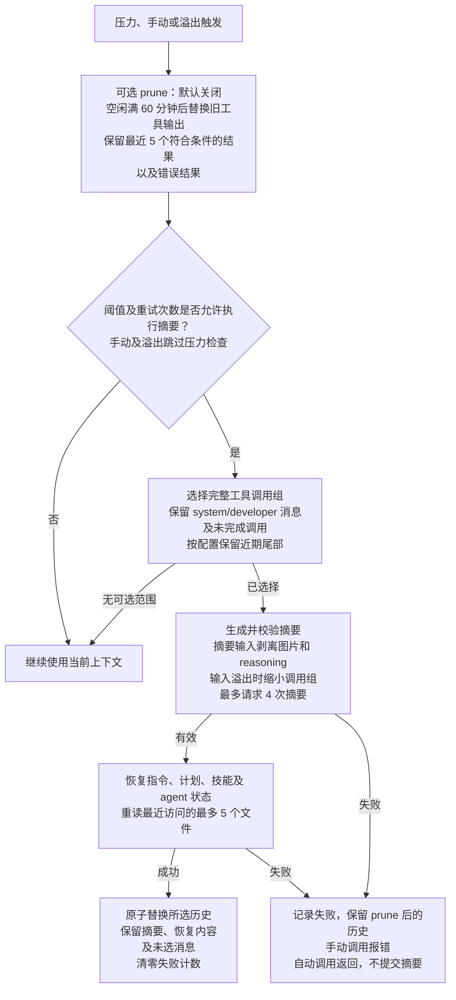

# dsh-context-claude-code

[English](README.md) | 简体中文

本包实现 Claude Code 2.1.88 中观察到的上下文管理流程。默认导出 DSH Cordis 插件，`createPipeline(config)` 导出独立流程，`strategy` 导出用于比较的预算和来源信息。公共核心只提供模型调用、文件读取、日志和安全提交。

```ts
import claudeCodeContext from 'dsh-context-claude-code';

ctx.plugin(claudeCodeContext, { prune: true, idleMinutes: 60 });
```

## npm 安装

发布后可用 `dsh plugin --profile web add dsh-context-claude-code` 安装。按 [npm 指南](https://github.com/zonemeen/dsh-context-zoo/blob/main/docs/publishing.zh-CN.md#使用已发布的包) 应用宿主 Session 补丁并生成启用配置。仅安装包不会替换当前上下文引擎。

## 上下文流程图

下图采用默认配置。Prune 在判断是否需要摘要之前，先替换当前上下文中的旧工具输出。后续摘要失败不会撤销已完成的 prune。原始消息始终保留在持久化会话日志中。



提交前，宿主还会检查所选输入未改变，且摘要加恢复内容严格小于所选历史。取消或校验失败时不提交摘要，已完成的 prune 仍保留。

## 流程

1. 使用最近一次 assistant 的 input、cache-read、cache-write 和 output usage 作为计量锚点，再估算之后新增的消息。无 usage 时采用本包的字符与图片估算；已记录的微压缩节省量从对应锚点扣除。
2. 可选 idle 微压缩在默认 60 分钟空闲后清除旧工具结果，保留最近 5 个，最少保留 1 个。它保护错误结果和工具调用身份，只处理明确的工具名称；默认关闭。
3. 自动阈值为窗口减去 `min(maxOutputTokens, 20000)` 与 13000 tokens。比例覆盖乘有效窗口，并受固定余量上限约束。手动和溢出恢复绕过压力阈值。
4. 选择完整工具调用组，保留 system/developer 节点与未完成调用；中途指令或工具更新会分隔会话段，已变成纯检查点的段会被跳过，后续历史仍可继续压缩。默认完整摘要，`keepRecentTokens` 可额外保留尾部。
5. 摘要请求剥离图片和 reasoning，默认保留工具文本；`summaryToolChars` 可限制单条工具文本。摘要最多 20000 tokens，并受模型输出上限限制。
6. 摘要自身溢出时，优先按错误报告的 token 缺口移除最旧完整 API 组；无缺口信息时移除约 20%。默认最多 4 次请求。空摘要、未闭合摘要、API 错误和输出截断均不提交。
7. 从 durable message source 恢复指令、最新计划状态、技能和 agent 状态；另恢复已成功调用的 skill 输出，并通过 DSH 文件服务重新读取最近成功访问的文件。默认最多 5 个文件，每个最多 5000 tokens；恢复总预算为 50000 tokens。技能单个最多 5000、累计最多 25000 tokens。拒绝/失败的读取不能授权恢复。
8. 成功后原子替换所选历史。连续 3 次自动压缩失败会暂停自动尝试；手动成功重置计数。每个请求系列默认最多 3 次溢出恢复，计数与失败状态均写入 Session。

`restoreContext: false` 关闭附件恢复；`maxRestoredFiles`、`maxFileTokens`、`maxRestoreTokens`、`maxSkillTokens` 可调整恢复预算。`maxSummaryAttempts`、`maxOverflowRetries`、`maxConsecutiveFailures` 控制不同层次的失败次数。`auto: false` 由 DSH 接入层关闭自动钩子，不禁止显式调用 pipeline。

## 来源与运行环境

源项目为 [anthropics/claude-code](https://github.com/anthropics/claude-code)。实际参考本地 [Claude Code 源码还原项目](https://github.com/ponponon/claude_code_src)，其 README 标识 `@anthropic-ai/claude-code 2.1.88`。本地没有 Git 元数据；`src/services/compact/autoCompact.ts` 的 SHA-256 为 `1946b5ea23fa2eda91955378641258fb8f19e7742f06ce17d6caae7f2d3c921a`。源码及提示词均未复制。

非官方来源未提供可验证的开源许可证，不代表当前产品的全部实现。该版本中受私有 feature gate 控制的服务端 cache-edit、session-memory 和 context-collapse 接口无法经 DSH 模型接口调用。可用的指令、技能、计划和 agent 状态来自 DSH 已记录消息的 source，文件权限由 DSH 文件服务执行；没有原生状态时不会生成虚构附件。
