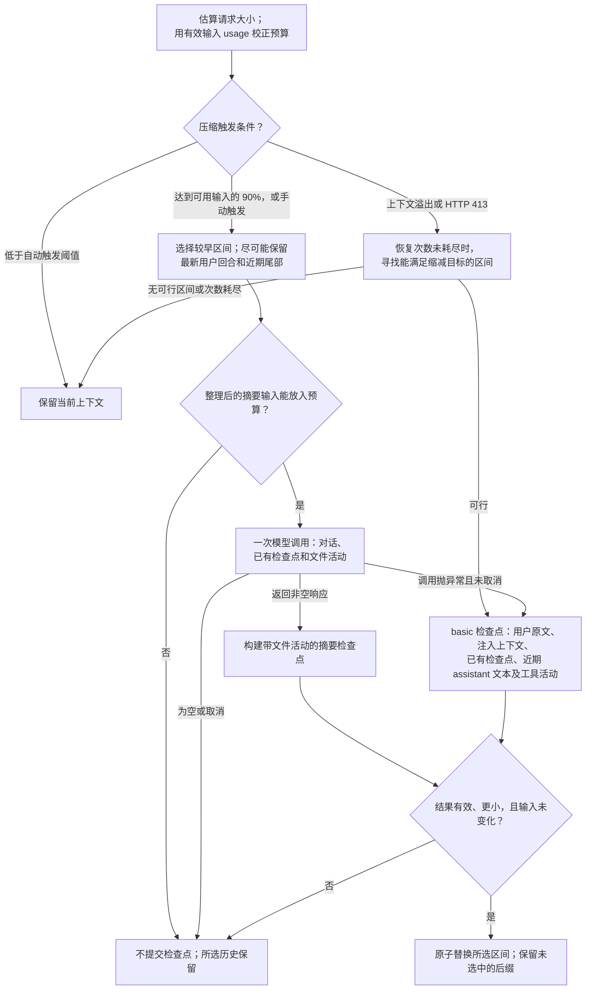

# dsh-context-cline

[English](README.md) | 简体中文

将 Cline SDK 的上下文管理流程适配为 DeepSeek Harness 插件：生成模型摘要、保留近期对话、记录文件活动，在摘要调用异常或上下文溢出时执行无需模型调用的压缩。默认导出 DSH Cordis 插件，`createPipeline(config)` 提供流程，`strategy` 导出预算和来源信息。

## 安装

发布后使用 `dsh plugin --profile web add dsh-context-cline` 安装，再按 [npm 指南](https://github.com/zonemeen/dsh-context-zoo/blob/main/docs/publishing.zh-CN.md#使用已发布的包) 应用宿主 Session 补丁并生成启用配置。

从源码接入时，按照[根目录安装说明](https://github.com/zonemeen/dsh-context-zoo/blob/main/README.zh-CN.md#接入-dsh)操作，包路径使用 `./packages/cline`，配置生成器的 agent id 使用 `cline`。宿主使用 DSH `0.1.7-rc.2` 并应用仓库提供的 Session 补丁。包声明 `dsh.bundle.patch: []`；安装后还需应用生成的覆盖补丁，才会替换当前压缩引擎。一个 profile 使用一种策略。

```ts
import clineContext from 'dsh-context-cline';

ctx.plugin(clineContext, {
  keepRecentTokens: 20000,
  maxSummaryTokens: 8192,
});
```

## 上下文流程图

下图展示默认配置下的模型摘要与无需模型调用的 basic 恢复两条路径。两者都尽可能保留近期后缀，并将一段较早的连续历史替换为检查点。



本流程没有独立的工具结果 prune 阶段。文本和附件长度限制作用于摘要辅助输入。basic 恢复不调用模型、不读取文件；取消、空输出和被拒绝的输出不会触发该回退。system/developer 消息和未完成的工具调用始终受保护，原始消息保留在持久会话日志中。

## 流程

1. 按序列化消息的每三个字符约一个 token 估算，并将 system/developer 消息和工具 schema 计入请求预算。有显式输入上限时，取该上限与上下文窗口的较小值；否则使用窗口的 90%。达到可用输入预算的 90% 时自动压缩，即未提供输入上限时为窗口的 81%。
2. 使用最近一次有效 assistant 输入 usage 校正预算，最多将预算缩小至四分之一。DSH 的缓存计数只计入一次，输出 usage 不参与校正。忽略早于当前检查点、来自其他模型或早于已观察到的当前回合的 usage。
3. 自动目标为触发预算的 70%；至少五组 user/assistant 消息且模型输出上限小于可用输入预算时，改为可用输入预算的 50%。手动与溢出目标为当前消息估算量的一半，且不超过触发阈值。消息预算扣除受保护指令和工具 schema 的开销。
4. 默认保留约 20,000 tokens 的近期历史，并受目标预算限制。存在后续用户请求时保留完整的最新用户回合；单个初始长回合可以按预算分割。切点向前调整以保留完整工具调用对。system/developer 消息将历史分为连续区间并保留原位；最新用户回合之前的区间可以整体压缩，只包含已有检查点的区间会跳过。
5. 将历史、之前的检查点和文件活动序列化为文本，发送一次不带工具的摘要请求。去掉 reasoning，默认每段工具结果和序列化附件限制为 2,000 字符。预算不足时进一步缩短工具文本，并从摘要输入副本中省略较旧的完整 assistant/工具组。用户文本和已有检查点始终保留；仍无法容纳则跳过摘要。由于宿主无法查询独立摘要模型的能力，切换到其他摘要模型时使用保守的 1,024-token 输入预算。
6. 要求 Goal、State、Highlights、Next、Files 章节；返回结果缺少 Files 时，补入本次所选历史中可识别的文件活动。默认输出上限为 8,192 tokens，并受当前路由输出上限限制；显式 `maxSummaryTokens` 优先。成功后写入 `Context summary` 检查点，保留近期结构化消息。空摘要跳过；非空但被截断、失败、包含非文本内容或未缩小历史的结果拒绝提交。
7. 摘要调用抛异常时，对所选区间进行无需模型调用的恢复。保留用户原文、注入上下文、已有检查点，以及全局最近三条 assistant 文本中属于该区间的内容。保留最新用户请求的附件，省略更早用户请求的附件。记录文件读取、编辑尝试和命令，并标记失败结果。取消操作直接传播，不执行回退。
8. 上下文溢出和 HTTP 413 直接使用无需模型调用的恢复。优先保留能与检查点一起放入目标预算的完整近期后缀。默认每个已观察到的用户回合只允许一次恢复，次数持久化到 DSH 会话。仅当压缩后的上下文更小且满足恢复目标时重试；必须保留的内容导致目标无法满足时，所选历史保持原样。

## 配置

编辑生成配置中各个 `dsh-context-cline` 行的 `config`。DSH 替换整个 config 对象，需要的设置应放在一起。

| 设置 | 默认值与含义 |
| --- | --- |
| `auto` | `true`；控制 DSH 自动钩子，显式调用 pipeline 仍可执行 |
| `thresholdRatio` | usage 校正后可用输入预算的 `0.9` |
| `reserveTokens` | `0`；额外限制触发值不超过 `usableInput - reserveTokens` |
| `keepRecentTokens` | `20000`；模型摘要切点的近期 token 保留目标，受完整回合和消息预算约束；`0` 仍保留最后一条消息或其完整工具交换 |
| `maxSummaryTokens` | 默认 `8192`，默认值受当前路由输出上限限制；显式配置优先 |
| `summaryToolChars` | `2000`；摘要输入中的单段工具文本上限；`0` 初始保留完整文本，预算整理仍可能缩短 |
| `summarizationProvider`、`summarizationModel` | 默认当前路由，覆盖时必须同时设置 |
| `maxOverflowRetries` | 每个已观察到的回合 `1` 次；宿主没有 turn key 时使用请求系列；`0` 禁用溢出恢复 |
| `maxConsecutiveFailures` | 默认不限；设置后，达到连续失败次数将暂停压力触发，手动调用仍可用 |

每次压缩只尝试一次模型摘要。`maxSummaryAttempts`、`summaryRetryDelayMs`、裁剪和文件重读设置不影响此流程。无需模型调用的恢复也不会读取工作区文件。

## 宿主适配与限制

DSH 将一个连续区间替换为一条 user 检查点；Cline 原生 basic 可以返回多条保留角色的消息。本插件将保留的用户请求和 assistant 文本写入检查点内容块，并保留完整的近期后缀。最近三条以外的旧回合最终答复可能被省略。原生预算整理可以裁剪更多消息和附件形式；本插件会跳过在保留用户文本前提下无法放入预算的请求。这些差异可能减少可压缩的历史范围。

当前 DSH 宿主适配器只提供上下文窗口，未提供独立输入上限；自定义 `ContextHost` 可传入 `inputLimit`。估算使用 DSH 消息序列化形式。宿主未提供逐请求 thinking 控制、独立摘要模型元数据、原生输出上限恢复触发、Cline 压缩 hooks、UI 元数据或会话侧车导入。恢复依赖 DSH 检查点和持久化插件事件，不重建 Cline 运行环境。

## 来源与验证

参考 [cline/cline 固定版本](https://github.com/cline/cline/tree/252082b9e93b4f91253876391e35b4c13326f5e6)，提交 `252082b9e93b4f91253876391e35b4c13326f5e6`，采用 [Apache-2.0](https://github.com/cline/cline/blob/252082b9e93b4f91253876391e35b4c13326f5e6/LICENSE) 许可证。主要参考文件为 `sdk/packages/core/src/extensions/context/{compaction,agentic-compaction,basic-compaction,compaction-shared}.ts`、`budget-projection/project.ts` 和 `sdk/packages/core/src/session/models/session-compaction.ts`。

本地自动测试覆盖适配后的流程与 DSH 接入。Cline 已通过 [2026-09-27 DeepSeek 实际 API 检查](https://github.com/zonemeen/dsh-context-zoo/blob/main/reports/deepseek/2026-09-27/README.zh-CN.md)：手动压缩将上下文估算量从 5,506 降至 1,844 tokens，减少 66.5%；压缩前和会话回放后的事实召回均为 10/10。摘要输出上限为 2,048 tokens，三次请求均返回 HTTP 200。配置凭据后，可通过 `pnpm test:deepseek --agent cline` 重新运行。
