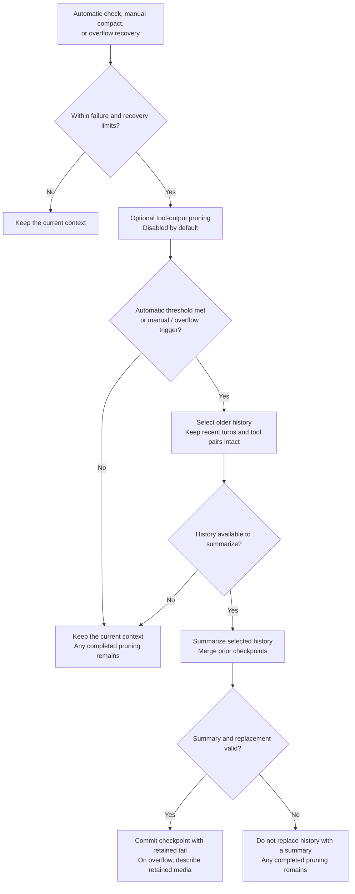

# OpenCode Context Strategy

English | [简体中文](README.zh-CN.md)

This package adapts the OpenCode workflow for usage accounting, tool-output pruning, retained-history selection, summary requests, result validation, and overflow recovery. DSH reads the log, calls the model, and commits replacements.

## npm installation

After release, install with `dsh plugin --profile web add dsh-context-opencode`. Apply the host Session patch and generate the activation overlay as described in the [npm guide](https://github.com/zonemeen/dsh-context-zoo/blob/main/docs/publishing.md#using-the-published-packages). Installing the package alone does not replace the active context engine.

## Context flow

Optional tool-output pruning runs before the automatic threshold check. Recent turns stay outside the summary replacement; on overflow, the latest user message is also retained when earlier user history exists. Transcript clipping only affects summary input; original messages remain in the session log.

## Default behavior

- Uses the provider's total usage when available, or sums input, output, and cache usage. Without usage data, it estimates tokens by dividing the message JSON character count by 4 after removing DSH identity fields.
- When the model has a separate input limit, subtracts `reserveTokens` from that limit; the default reserve is the smaller of the output budget and 20,000 tokens. With only a total context window, subtracts the output budget, which defaults to 32,000 tokens when unavailable.
- Triggers when usage reaches the threshold. The retention budget is 25% of the usable window, with a minimum of 2,000 and a maximum of 15,000 tokens. Retains complete recent user turns first; when a turn does not fit, finds a suffix that fits while keeping tool calls and results together.
- Tool-output pruning is disabled by default. When enabled, scans backward from the newest messages and processes older results only after passing the second user message. Protects the first 40,000 tokens of accumulated tool output and the `skill` tool. Stops at a previous summary or a cleared result. Clears candidate outputs only when their total strictly exceeds 20,000 tokens; error results are retained.
- Sends a separately serialized transcript for summarization, preserving tool names and arguments. Each tool output is limited to 2,000 characters by default. Merges the previous summary using the headings Objective, Important Details, Work State, Next Move, and Relevant Files.
- Limits summary output to the smaller of the current output budget and 32,000 tokens by default. Rejects blank, truncated, error, tool-call, and media responses. A failed summary does not commit a summary replacement.
- On overflow, retains the latest user message at the end when earlier user history is available, and compacts that earlier history first. After success, converts media in retained user messages to attachment descriptions and adds continuation instructions. Original attachments remain intact if summarization fails.

`reserveTokens`, `thresholdRatio`, and `keepRecentTokens` override the budgets; the ratio applies to the window after subtracting the reserve. `tailTurns` limits the maximum number of retained user turns; setting it to 0 summarizes all selected history. `maxSummaryTokens`, `summaryToolChars`, `summarizationProvider`, and `summarizationModel` control the auxiliary request. `maxOverflowRetries` defaults to 1 per request sequence. The optional `maxConsecutiveFailures` setting pauses automatic processing after repeated failures; a successful manual compaction resets the count.

## Implementation scope

Use `createPipeline(config)` directly through `run(host, trigger)` and `summarizeRange(host, entries)`. This package maintains the adapted algorithms, summary text, and state records. Previous summaries and recovery counters are recorded in the session log. `auto: false` disables DSH's automatic hooks; explicit calls still run.

OpenCode's provider-specific message encoders and third-party plugin hooks require its runtime. This package uses DSH's message representation and keeps tool calls and results together where the two representations group messages differently. Media continuation uses DSH user-message replacement records; original attachments remain in the historical log.

DSH's system and developer messages stay in place. The plugin applies OpenCode's retention algorithm to each history segment, skipping segments where only existing checkpoints would be selected. Usage accounting still covers the full context. Summaries merge every checkpoint in the current context and fall back to plugin state records only when the context has no checkpoints, avoiding stale summary metadata when restoring a session.

Original project: [anomalyco/opencode](https://github.com/anomalyco/opencode). The inspected local fork is pinned to `beb99270834db8eb62cf3a369e99234d4d4c2cbd`. The source project uses the MIT license. Budget and pruning behavior come from `packages/opencode/src/session/`; summary headings come from `packages/core/src/session/compaction.ts`, which that implementation calls. Summary instructions are defined in `src/strategy.ts`.
