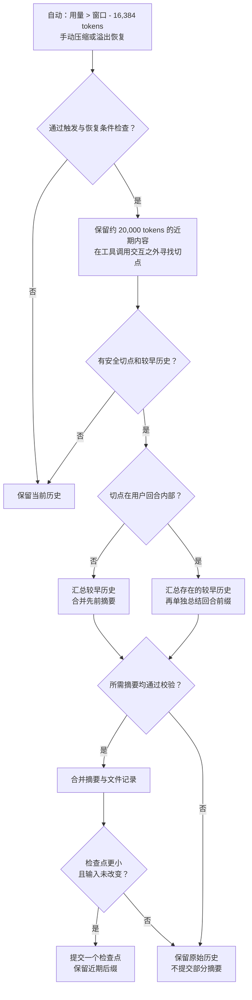

# Pi 上下文策略

[English](README.md) | 简体中文

本包实现 Pi 的用量估算、切点选择、历史与回合前缀摘要、文件操作记录、分支摘要及恢复流程。DSH 只提供会话观察、模型调用和提交操作。

## npm 安装

发布后可用 `dsh plugin --profile web add dsh-context-pi` 安装。按 [npm 指南](https://github.com/zonemeen/dsh-context-zoo/blob/main/docs/publishing.zh-CN.md#使用已发布的包) 应用宿主 Session 补丁并生成启用配置。仅安装包不会替换当前上下文引擎。

## 上下文流程图

下图展示默认配置。Pi 保留近期后缀并汇总较早历史，不裁剪实时上下文中的工具输出。切点落在回合内部时，还要单独总结该回合前缀，让保留的后半段仍能被理解。原始消息仍保存在会话日志中。

## 默认行为

- 读取最近一条有效 assistant usage，排除错误、取消及零用量，再加上后续消息的字符估算。文本、推理、工具名及参数按字符数除以 4 向上取整；每张图片按 1,200 tokens 计。压缩前旧消息的 usage 不再触发新压缩。
- 默认预留 16,384 tokens；用量严格大于窗口减去预留时触发。
- 从后往前累计约 20,000 tokens，在用户或 assistant 消息处切分，工具结果不能独立成为尾部。找不到安全切点时保留当前历史。
- 切点位于一个回合内部时，分别调用模型总结更早历史和该回合前缀，再合并结果。前缀使用 Original Request、Early Progress、Context for Suffix 章节，供保留的后半个回合继续工作。
- 普通历史摘要使用 Goal、Constraints & Preferences、Progress、Key Decisions、Next Steps、Critical Context，并合并先前摘要。历史摘要默认输出预算为预留的 80%，回合前缀为 50%，均受模型输出上限约束。
- 摘要输入中的工具输出默认最多 2,000 字符；实时上下文中的旧工具结果不会因此改变。
- 累计 `read`、`edit`、`write` 的文件路径，并以 `<read-files>` 和 `<modified-files>` 记录。修改过的文件从只读列表中移除，后续压缩继续继承这些记录。
- 瞬时网络或 provider 错误默认最多重试 3 次，延迟为 2、4、8 秒，上限 60 秒。配额、计费、取消、截断及工具调用响应不会被当作瞬时故障重试。任一摘要失败均不会提交部分结果。
- 每个请求序列默认只进行一次溢出恢复；DSH 未提交的失败请求保留在 attempt 日志中，不进入下一次模型上下文。

`reserveTokens`、`thresholdRatio`、`keepRecentTokens` 可以覆盖预算；比例作用于扣除预留后的窗口。`maxSummaryTokens` 覆盖历史和前缀的输出预算。`maxSummaryAttempts` 包括首次请求，默认 4；`summaryRetryDelayMs` 调整重试基础延迟。`maxConsecutiveFailures` 可限制自动流程的连续失败次数，手动成功后清零。`auto: false` 只关闭自动钩子。

## 分支摘要

`createPipeline(config).summarizeBranch(host, entries)` 总结调用方给出的分支记录。输入过长时从近期记录向前选取，已有 checkpoint 在剩余预算充足时优先保留。输出默认上限为 4,096 tokens，并累计已有摘要中的文件操作记录。返回文本可注入目标分支；该方法不会替换当前会话历史。

## 实现范围

DSH 负责持久化与请求路由，本包维护全部选择和转换步骤。Pi 会话树 UI、第三方扩展处理器依赖 Pi 运行时；本包通过显式分支方法和配置提供入口。Pi 辅助请求的缓存写入禁用需要 provider 支持，当前 DSH 模型接口未提供该设置。

DSH 的 system 与 developer 消息保留原位；插件在每个相邻历史段内运行 Pi 的切点算法，跳过没有可压缩前缀的段。用量判断覆盖完整上下文。摘要及文件操作记录继承当前上下文中的全部 checkpoint；只有当前上下文没有 checkpoint 时才回退到插件状态记录。任何当前 checkpoint 之前记录的 usage 都视为过期。

源项目为 [earendil-works/pi](https://github.com/earendil-works/pi)；实际参考本地 fork 的提交 `8a7b0c03dfb702663acafb6dc29f8acaa4ffe391`，源项目采用 MIT 许可证。参考入口为 `packages/coding-agent/src/core/compaction/compaction.ts`。摘要指令定义在 `src/strategy.ts` 中。
