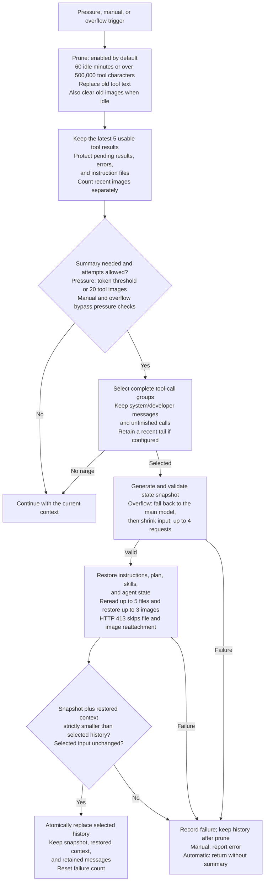

# dsh-context-qwen-code

English | [简体中文](README.zh-CN.md)

This package implements the context workflow from a pinned revision of the zonemeen Qwen Code fork. The default export is a DSH Cordis plugin; `createPipeline(config)` exports a standalone pipeline, and `strategy` provides budget comparisons and source information. The shared core provides model calls, file access, logging, and safe commits; this package defines its own strategy.

```ts
import qwenCodeContext from 'dsh-context-qwen-code';

ctx.plugin(qwenCodeContext, {
  toolHighWaterChars: 500000,
  toolLowWaterChars: 250000,
  keepRecentTools: 5,
});
```

## npm installation

After release, install with `dsh plugin --profile web add dsh-context-qwen-code`. Apply the host Session patch and generate the activation overlay as described in the [npm guide](https://github.com/zonemeen/dsh-context-zoo/blob/main/docs/publishing.md#using-the-published-packages). Installing the package alone does not replace the active context engine.

## Context flow

The diagram uses default settings. Prune updates the active context before checking whether a summary is needed. Summary generation and restoration form a later atomic replacement; their failure does not undo prune. The durable session log keeps the original messages.



Before committing, the host checks that the selected input is unchanged and the snapshot plus restored context is strictly smaller than the selected history. Cancellation or failed validation prevents the summary commit; any completed prune remains.

## Workflow

1. Use the latest API usage as an anchor, then add output usage and estimates for new messages. Apply a 1.5 multiplier to new content as a margin. Subtract persisted microcompaction savings from the same anchor.
2. Microcompaction is enabled by default. After 60 idle minutes, clear older tool results and images. When tool text exceeds 500000 characters, clear it toward a target of 250000 characters. Preserve the latest 5 usable tool results, results awaiting submission, error results, and instruction files. Media retention is counted separately. Record cleared file paths and savings.
3. The automatic threshold is `min(0.85 × window, window - 20000 - 13000)`; very small windows use the proportional value. Images in tool results can also trigger compaction when their count reaches 20 by default. User-uploaded images do not count toward this trigger. `screenshotTriggerImages: 0` disables it.
4. Select the full history by default while preserving system/developer messages and unfinished tool calls. Updates during a conversation divide history into segments; skip checkpoint segments that have already been summarized and continue with later history. `keepRecentTokens` can retain a recent tail. Summary requests remove images and reasoning. Ordinary compaction does not truncate tool text; HTTP 413 recovery shortens text to reduce request size.
5. The output budget is limited by 20000 tokens, the model's output limit, and `window - estimatedInput - 1024`. The summary prompt requires a complete, nonempty `<state_snapshot>`. Reject truncated output, empty or unclosed summaries, and results that increase the history size after restoration.
6. If the configured summary model encounters context overflow, first fall back to the main model. On further overflows, remove the oldest complete API groups and retry with smaller input. Allow at most 4 summary requests by default.
7. Restore instructions, the latest plan, skills, and agent state from persisted message sources. Restore invoked skill content, reread up to 5 files recently accessed successfully, and restore the latest 3 images. Files are limited to 5000 tokens each by default, within a total restoration budget of 50000 tokens. HTTP 413 recovery preserves essential state while suppressing file and image reattachment.
8. Reset the failure counter after a successful atomic commit. Three consecutive automatic failures pause pressure-triggered compaction; explicit manual compaction and overflow recovery remain available. Allow at most 3 overflow recovery attempts per request series by default, with the counter persisted in the Session.

`reserveTokens` and `thresholdRatio` adjust budgets. `idleMinutes`, `toolHighWaterChars`, `toolLowWaterChars`, and `keepRecentTools` adjust microcompaction. `maxRestoredFiles`, `maxRestoredImages`, `maxFileTokens`, `maxRestoreTokens`, and `maxSkillTokens` adjust restoration; `restoreContext: false` disables it. `summaryToolChars: 0` preserves complete tool text in summary requests. The integration disables automatic hooks when `auto: false`; explicit pipeline calls remain available.

## Sources and runtime

Original project: [QwenLM/qwen-code](https://github.com/QwenLM/qwen-code), licensed under Apache-2.0. The inspected local fork is pinned to `151a6bc5aff6287264f81968efb7a19c37f3c03e`. This fork's summary and attachment restoration workflow should not be attributed to the upstream project's current default behavior.

The DSH model interface does not provide Qwen's native hook endpoints or private provider cache-sharing requests. Restorable host state comes from DSH's persisted message sources. File rereads use the DSH file service, and images use recorded attachment references. The package does not read other agents' local logs or fabricate their runtime state.
