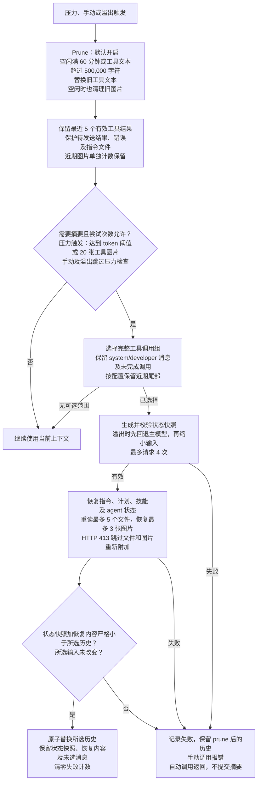

# dsh-context-qwen-code

[English](README.md) | 简体中文

本包实现 zonemeen Qwen Code fork 固定版本的上下文流程。默认导出 DSH Cordis 插件，`createPipeline(config)` 导出独立流程，`strategy` 提供预算比较与来源信息。公共核心提供模型、文件、日志与安全提交，不决定此包的策略。

```ts
import qwenCodeContext from 'dsh-context-qwen-code';

ctx.plugin(qwenCodeContext, {
  toolHighWaterChars: 500000,
  toolLowWaterChars: 250000,
  keepRecentTools: 5,
});
```

## npm 安装

发布后可用 `dsh plugin --profile web add dsh-context-qwen-code` 安装。按 [npm 指南](https://github.com/zonemeen/dsh-context-zoo/blob/main/docs/publishing.zh-CN.md#使用已发布的包) 应用宿主 Session 补丁并生成启用配置。仅安装包不会替换当前上下文引擎。

## 上下文流程图

下图采用默认配置。Prune 先更新当前上下文，再判断是否需要摘要。摘要生成与内容恢复随后通过原子替换提交，这一步失败不会撤销 prune。原始消息始终保留在持久化会话日志中。



提交前，宿主还会检查所选输入未改变，且状态快照加恢复内容严格小于所选历史。取消或校验失败时不提交摘要，已完成的 prune 仍保留。

## 流程

1. 使用最近 API usage 锚点，加上输出和新增消息估算；新增内容采用 1.5 倍余量。已持久化的微压缩节省量从同一锚点扣除。
2. 微压缩默认启用。60 分钟空闲触发旧工具结果与图片清理；工具文本超过 500000 字符时清理至 250000 的目标水位。保留最近 5 个有效工具结果、当前待发送结果、错误结果及指令文件；媒体有独立的保留数量。记录清理文件路径和节省量。
3. 自动阈值为 `min(0.85 × window, window - 20000 - 13000)`，极小窗口使用比例值。工具结果中图片达到默认 20 张也可触发压缩，用户上传图片不计入该触发条件。`screenshotTriggerImages: 0` 关闭此触发。
4. 默认选择完整历史，保护 system/developer 节点及未完成工具调用；中途更新将历史分段，跳过已摘要的检查点段后继续处理后续历史；`keepRecentTokens` 可保留尾部。摘要请求剥离图片和 reasoning，普通压缩不裁剪工具文本；HTTP 413 恢复会缩短文本以降低请求体积。
5. 输出预算同时受 20000 tokens、模型输出上限和 `window - estimatedInput - 1024` 限制。摘要提示词要求完整非空的 `<state_snapshot>`。输出截断、空/未闭合摘要、恢复后体积增加均拒绝提交。
6. 配置的摘要模型发生上下文溢出时，先回退主模型；后续溢出按最旧完整 API 组缩小输入重试。默认最多 4 次摘要请求。
7. 从持久化 source 恢复指令、最新计划、技能与 agent 状态；恢复已调用 skill 内容，重读最近成功访问的最多 5 个文件，并恢复最近 3 张图片。文件每个默认最多 5000 tokens，恢复总预算默认 50000 tokens。HTTP 413 路径保留必要状态，抑制文件与图片重新附加。
8. 原子提交成功后清零失败计数；连续 3 次自动失败暂停压力压缩，显式手动与溢出恢复仍可尝试。每个请求系列默认最多 3 次溢出恢复，计数在 Session 中持久化。

`reserveTokens`、`thresholdRatio` 调整预算；`idleMinutes`、`toolHighWaterChars`、`toolLowWaterChars`、`keepRecentTools` 调整微压缩。`maxRestoredFiles`、`maxRestoredImages`、`maxFileTokens`、`maxRestoreTokens`、`maxSkillTokens` 调整恢复；`restoreContext: false` 关闭恢复。`summaryToolChars: 0` 保留摘要请求中的完整工具文本。`auto: false` 由接入层关闭自动钩子，显式 pipeline 调用仍有效。

## 来源与运行环境

源项目为 [QwenLM/qwen-code](https://github.com/QwenLM/qwen-code)，采用 Apache-2.0 许可证；实际参考本地 fork 的提交 `151a6bc5aff6287264f81968efb7a19c37f3c03e`。此 fork 的摘要与附件恢复流程不能归为上游当前默认行为。

Qwen 原生 hook 端点及 provider 私有 cache-sharing 请求不由 DSH 模型接口提供；可恢复宿主状态从 DSH 的持久化 message source 读取。文件重新读取使用 DSH 文件服务，图片使用已记录的附件引用，不读取其他 agent 的本地日志或伪造其运行状态。
