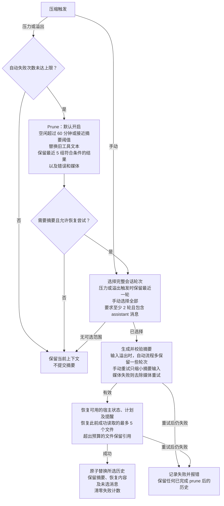

# ZCode 上下文插件

[English](README.md) | 简体中文

本包实现 ZCode 的用量判断、microcompaction、对话轮次选择、摘要重试和恢复提醒。默认导出 DSH Cordis 插件；`createPipeline(config)` 可直接接受 `ContextHost`，接入见[根目录说明](https://github.com/zonemeen/dsh-context-zoo/blob/main/README.zh-CN.md)。

## npm 安装

发布后可用 `dsh plugin --profile web add dsh-context-zcode` 安装。按 [npm 指南](https://github.com/zonemeen/dsh-context-zoo/blob/main/docs/publishing.zh-CN.md#使用已发布的包) 应用宿主 Session 补丁并生成启用配置。仅安装包不会替换当前上下文引擎。

## 上下文流程图

下图采用默认配置，轮次以 assistant 消息开始。自动压缩可先裁剪旧工具结果，再生成摘要；手动压缩跳过 prune。Prune 会立即改变当前上下文，后续摘要失败不会撤销它。原始消息始终保留在持久化会话日志中。

提交前，宿主还会检查所选输入未改变，且摘要加恢复内容严格小于所选历史。取消或校验失败时不提交摘要，已完成的 prune 仍保留。

## 默认流程

- 以上一次 assistant 的 provider usage 为基准，加上后续消息；无 usage 时使用字符数除以 4 的估算。缓存输入参与计数，裁剪后只扣除已包含在 usage 基准中的节省量。
- 达到 `contextWindow - min(maxOutputTokens, 21,000) - 13,000` 时执行完整压缩。microcompaction 提前在该阈值的 90% 与阈值减 2,000 两者中较小值触发；距离最后一条 assistant 超过 60 分钟也触发。
- microcompaction 按 assistant 工具批次分组，保留最近五组符合条件的结果；预计至少节省 256 tokens 才清理。错误和媒体结果保留。工具包含 Read、Bash、Grep、Glob、WebFetch、WebSearch、Edit、Write、ApplyPatch 及明确列出的 DSH 别名。
- 对话以 assistant 开始划分轮次。自动和溢出恢复保留最后一轮，手动压缩汇总全部选中历史；可汇总部分须包含至少两轮和一条 assistant。工具调用与结果保持完整。
- 摘要输入超限时，自动流程把更多近期轮次移到保留区；手动流程只从辅助摘要请求丢弃最早的完整轮次，并加入截断说明。最多调整三次。媒体请求失败时，再尝试一次不含媒体的摘要输入，日志中的原始媒体保留。
- 自动摘要失败最多尝试三次；明确不可重试的错误直接失败。连续三次操作失败后暂停自动压缩，手动成功后恢复。每个模型步骤默认只允许一次溢出恢复；连续三次在不足三个完整工具批次后再次填满上下文，会停止反复压缩。此计数在新用户回合重置。
- 摘要最多 20,000 tokens，并受模型输出上限限制。工具 schema 不超过 100 个时参与辅助请求。去除 `<analysis>`，提取可选 `
`；空白、截断、失败、工具调用和媒体摘要被拒绝。
- 成功后恢复观察到的计划、最近五个成功 Read 的内容、TODO、提醒和日志入口。每个文件最多 5,000 tokens，总计最多 50,000；超预算时仅恢复路径。保留区已包含的 Read 与 `.git` 文件不重复恢复。

## 配置

`reserveTokens` 覆盖输出预留；`thresholdRatio` 将完整压缩阈值直接设为窗口乘该比例。`tailTurns` 覆盖自动保留轮数，`keepRecentTokens` 可增加保留预算。`prune`、`idleMinutes`、`keepRecentTools`、`minPruneTokens` 控制 microcompaction。

`maxSummaryTokens`、`maxSummaryAttempts`、`summaryToolChars`、`summarizationProvider` 和 `summarizationModel` 控制辅助摘要；`summaryToolChars` 默认 0，保留工具输出全文。`maxOverflowRetries` 控制每个模型步骤的恢复次数，`maxConsecutiveFailures` 控制自动失败暂停。`maxRestoredFiles`、`maxFileTokens`、`maxRestoreTokens` 覆盖文件恢复预算，`restoreContext: false` 关闭恢复提醒。`auto: false` 关闭 DSH 自动钩子，显式调用仍可执行。

## 来源和 DSH 映射

参考 [zai-org/ZCode 固定版本](https://github.com/zai-org/ZCode/tree/29628c9acdb81b703bbd4080c207a0e7ce5e276e)，提交 `29628c9acdb81b703bbd4080c207a0e7ce5e276e`，Apache-2.0。流程对应 `apps/zcode-cli/packages/core/src/compact/{policy,microcompact}.ts`、`runtime/helpers/compact-selection.ts`、`runtime/methods/{compact-active,turn-loop-state,turn-model-step}.ts` 和 `runtime/helpers/compact-post-reminders.ts`。摘要指令定义在 `src/pipeline.ts` 中。

DSH 负责模型传输、附件编码、取消和会话事务。system/developer 消息保留原位；插件在这些消息之间逐段执行 ZCode 选择逻辑，并跳过无法形成可汇总区间的段。用量判断覆盖完整上下文。恢复计数、裁剪量和 Read 恢复基准写入日志，重建插件不会丢失。

计划优先使用宿主提供的 `approvedPlanPath`；否则只尝试读取当前 DSH 会话对应的 `.zcode/plans/plan-{sessionId}.md`，文件不存在便不注入。它不推断历史 ZCode 会话 ID。transcript 路径、实时提醒和 REPL 清理状态均由宿主提供；只有观察到清理成功才写入 REPL 提醒。

验证：在仓库根目录先运行 `pnpm build`，再运行 `node --test tests/zcode-kimi-pipelines.test.mjs`。
